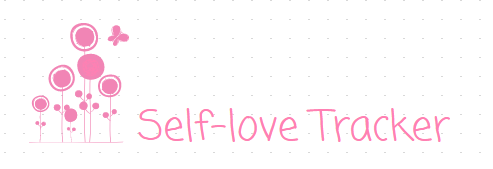
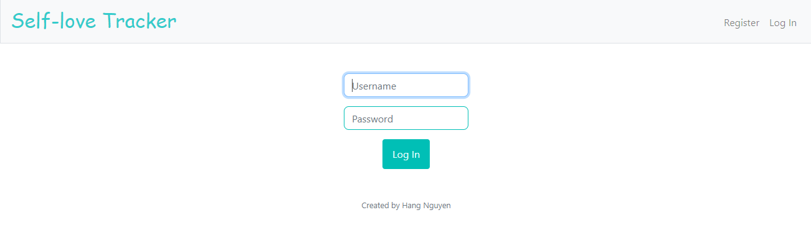
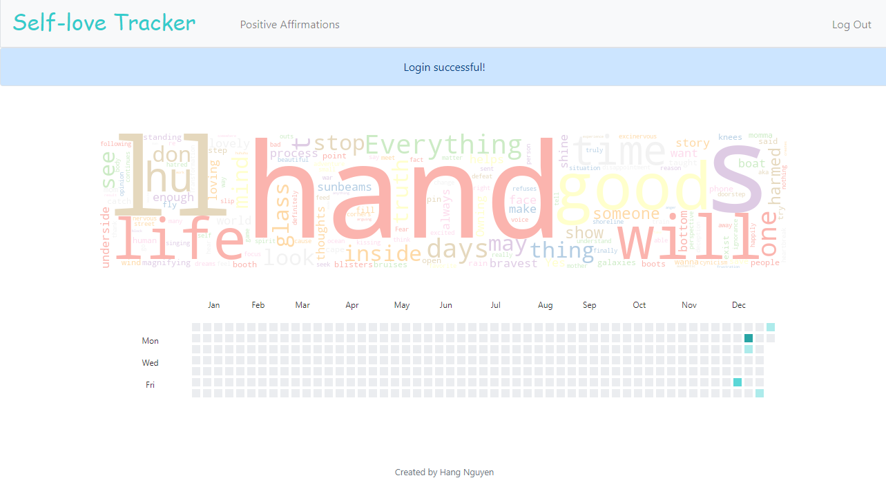
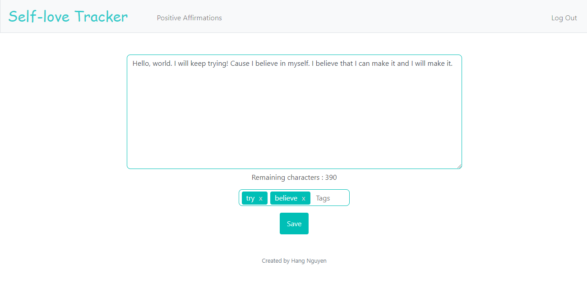
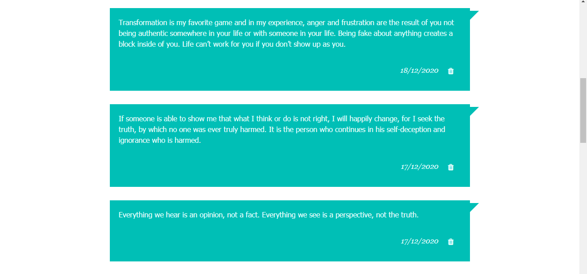

[![Contributors][contributors-shield]][contributors-url]
[![Forks][forks-shield]][forks-url]
[![Stargazers][stars-shield]][stars-url]
[![Issues][issues-shield]][issues-url]
[![MIT License][license-shield]][license-url]
[![LinkedIn][linkedin-shield]][linkedin-url]


<!-- PROJECT LOGO -->
<br />
<h1 align="center">
  CS50x
</h1>
<h2 align="center">
  Introduction to Computer Science
</h2>
<a align="center">
  
</a>
<h3 align="center">FINAL PROJECT</h3>

<p align="center">
 This Final Project is completed as a part of CS50x - Introduction to Computer Science, Harvard University. It's a web application named *“Self-love Tracker”*
</p>

## About this course
This is CS50x , Harvard University's introduction to the intellectual enterprises of computer science and the art of programming for majors and non-majors alike, with or without prior programming experience. An entry-level course taught by David J. Malan, CS50x teaches students how to think algorithmically and solve problems efficiently. Topics include abstraction, algorithms, data structures, encapsulation, resource management, security, software engineering, and web development. Languages include C, Python, SQL, and JavaScript plus CSS and HTML. Problem sets inspired by real-world domains of biology, cryptography, finance, forensics, and gaming. The on-campus version of CS50x , CS50, is Harvard's largest course.

<!-- TABLE OF CONTENTS -->
## Table of Contents

* [About the Project](#about-the-project)
  * [Built With](#built-with)
* [Getting Started](#getting-started)
  * [Prerequisites](#prerequisites)
* [Contributing](#contributing)
* [License](#license)
* [Contact](#contact)


<!-- ABOUT THE PROJECT -->
## About The Project


With a combination of Python, HTML, CSS, JavaScript and SQLite database, this web application is a place to store your daily possitive affirmations.
You could write as many affirmations each day, but remember to add tags for easier retrieve.
To read your affirmations, you could search by date, by tags or by exact words in text. Or if you have time, you could read all the affirmations.
The latest affirmations would be displayed on top.
The main page gives you an overview of the affirmations calendar (inspired by GitHub contributions graph) and a wordcloud made from your most frequently used words in the current year.

<p align="center">
  
  
  
  
</p>

### Built With

- Python 3/Flask
- HTML
- CSS
- JavaScript


<!-- GETTING STARTED -->
## Getting Started

To run the web application use these commands:

```
$ export FLASK_APP=application.py
$ flask run
```

### Prerequisites

- python 3
- flask
- cs50
- werkzeug
- matplotlib
- wordcloud
- datetime


<!-- CONTRIBUTING -->
## Contributing 

Contributions are what make the open source community such an amazing place to be learn, inspire, and create. Any contributions you make are **greatly appreciated**.
(to be updated)

1. Fork the Project
2. Create your Feature Branch (`git checkout -b feature/Self-lofe-Tracker`)
3. Commit your Changes (`git commit -m 'Add some changes to Self-lofe-Tracker'`)
4. Push to the Branch (`git push origin feature/Self-lofe-Tracker`)
5. Open a Pull Request


<!-- LICENSE -->
## License

Distributed under the MIT License. See `LICENSE` for more information.


<!-- CONTACT -->
## Contact

Hang Nguyen - hang.nguyen1@ucdconnect.ie


<!-- MARKDOWN LINKS & IMAGES -->
<!-- https://www.markdownguide.org/basic-syntax/#reference-style-links -->
[contributors-shield]: https://img.shields.io/github/contributors/fallingstar3107/Amazon-SageMaker-Capstone-Project.svg?style=flat-square
[contributors-url]: https://github.com/fallingstar3107/Amazon-SageMaker-Capstone-Project/graphs/contributors
[forks-shield]: https://img.shields.io/github/forks/fallingstar3107/Amazon-SageMaker-Capstone-Project.svg?style=flat-square
[forks-url]: https://github.com/fallingstar3107/Amazon-SageMaker-Capstone-Project/network/members
[stars-shield]: https://img.shields.io/github/stars/fallingstar3107/Amazon-SageMaker-Capstone-Project.svg?style=flat-square
[stars-url]: https://github.com/fallingstar3107/Amazon-SageMaker-Capstone-Project/stargazers
[issues-shield]: https://img.shields.io/github/issues/fallingstar3107/Amazon-SageMaker-Capstone-Project.svg?style=flat-square
[issues-url]: https://github.com/fallingstar3107/Amazon-SageMaker-Capstone-Project/issues
[license-shield]: https://img.shields.io/github/license/fallingstar3107/Amazon-SageMaker-Capstone-Project.svg?style=flat-square
[license-url]: https://github.com/fallingstar3107/Amazon-SageMaker-Capstone-Project/blob/master/LICENSE.txt
[linkedin-shield]: https://img.shields.io/badge/-LinkedIn-black.svg?style=flat-square&logo=linkedin&colorB=555
[linkedin-url]: https://www.linkedin.com/in/hang-nguyen-analytics/
[product-screenshot]: images/screenshot.png
